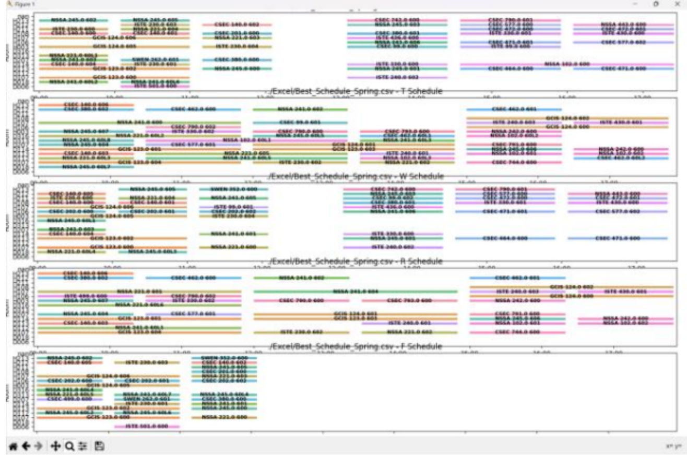
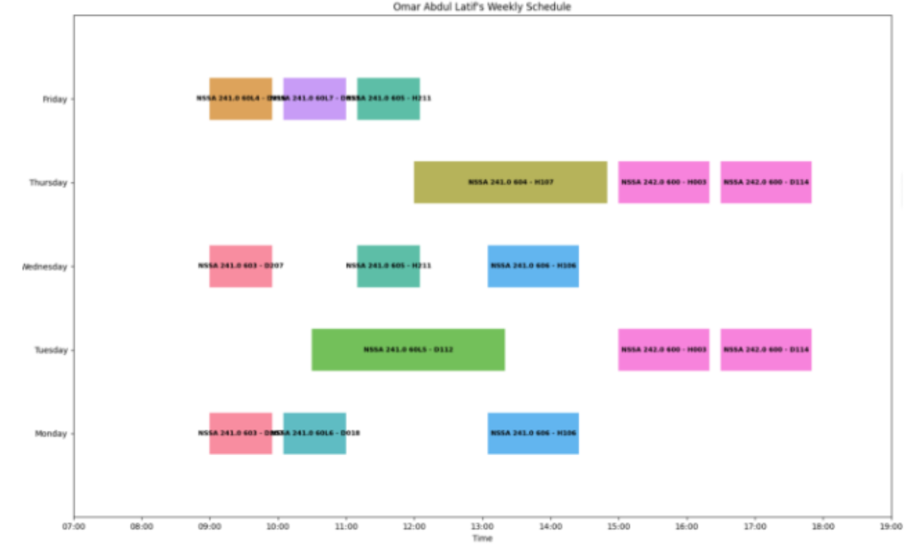

# 🎓 RIT Course Scheduling Computing Department

An intelligent course scheduling system designed for the Rochester Institute of Technology (RIT) Computing Department. This system uses genetic algorithms to automatically generate optimal course schedules while considering classroom capacity, instructor availability, course prerequisites, and time conflicts.

## 👥 Team Members
- **Mohammed Abu Mustafa**
- **Noora AlNuaimi** 
- **Johnson Maliakal**

## 🚀 Features

### 🧹 **Data Cleaning & Processing**
- Clean and process Excel files containing course data
- Filter courses by department (Computing, ISTE, NSSA, CSEC, etc.)
- Handle duplicate columns and malformed data
- Generate clean CSV files for scheduling algorithms

### 🧬 **Genetic Algorithm Scheduler**
- Advanced genetic algorithm implementation using PyGAD
- Optimizes course schedules based on multiple constraints
- Handles classroom capacity, time conflicts, and instructor preferences
- Configurable generation parameters for fine-tuning

### 📊 **Interactive Visualizations**
- **Classroom Schedule Visualization**: Gantt chart showing all courses across time slots and rooms
- **Instructor Schedule Visualization**: Individual instructor workload and schedule analysis
- **Conflict Detection**: Automatic identification of scheduling conflicts
- **Weekly Schedule View**: Clear day-by-day breakdown of courses

### 🖥️ **User-Friendly GUI**
- Intuitive Tkinter-based graphical interface
- File selection dialogs for Excel and CSV files
- Progress tracking with visual progress bars
- Real-time generation status updates

## 📁 Project Structure

```
course-scheduling-main/
├── 📊 Excel/
│   ├── 2023-2024 Plan for Dept Heads.xlsx  # Original course data
│   ├── classrooms.csv                      # Classroom capacity and types
│   └── prerequisites.csv                   # Course prerequisite relationships
├── 🐍 Python Files/
│   ├── main.py                            # Main GUI application
│   ├── algo_final.py                      # Genetic algorithm implementation
│   ├── cleaning_moh_final.py              # Data cleaning and processing
│   ├── visualizer.py                      # Classroom schedule visualization
│   └── instructor_visualizer.py           # Instructor schedule visualization
├── 📓 Documentation/
│   ├── README.md                          # This file
│   ├── install_instructions.txt           # Installation guide
│   └── rough_notes.ipynb                  # Development notes and experiments
└── 🖼️ Visualizations/
    ├── idea1.png                          # Course schedule visualization example
    └── idea2.png                          # Instructor schedule example
```

## 🖼️ Visualizations

### Course Schedule Overview

*Comprehensive course schedule showing all classes across different days and time slots. Each colored bar represents a different course with room assignments and time blocks.*

### Instructor Schedule Example

*Individual instructor schedule showing Omar Abdul Latif's weekly course load with specific room assignments and time slots.*

## 🛠️ Installation & Setup

### Prerequisites
- Python 3.7 or higher
- pip (Python package installer)

### Required Python Packages
Install the following packages using pip:

```bash
pip install pandas
pip install pygad
pip install matplotlib
pip install seaborn
pip install openpyxl
pip install xlrd
```

### Quick Start
1. **Clone the repository**:
   ```bash
   git clone https://github.com/MohammedAbuMutafa/rit-course-scheduling-computing-department.git
   cd rit-course-scheduling-computing-department
   ```

2. **Install dependencies**:
   ```bash
   pip install -r requirements.txt
   ```

3. **Run the application**:
   ```bash
   python main.py
   ```

## 📖 How to Use

### 1. **Clean Excel File**
- Select "Clean Excel File" from the main menu
- Choose your Excel file containing course data
- Select the appropriate sheet (e.g., "Spring 2024", "Fall 2024")
- The system will clean and process the data automatically

### 2. **Generate Course Schedule**
- Select "Generate Course Schedule"
- Enter the number of generations for the genetic algorithm
- Select Spring and Fall CSV files (cleaned data)
- Click "OK" to start the optimization process
- Monitor progress with the visual progress bar

### 3. **Visualize Schedules**
- **Classroom Visualizer**: View overall course distribution across rooms and time slots
- **Instructor Visualizer**: Analyze individual instructor schedules and workloads

## 🧬 Algorithm Details

### Genetic Algorithm Parameters
- **Population Size**: Configurable based on problem complexity
- **Generations**: User-defined for optimization depth
- **Fitness Function**: Considers multiple factors:
  - Classroom capacity constraints
  - Time conflict avoidance
  - Instructor availability
  - Course prerequisite satisfaction

### Constraint Handling
- **Hard Constraints**: Must be satisfied (classroom capacity, time conflicts)
- **Soft Constraints**: Optimized for (instructor preferences, room types)
- **Penalty System**: Automatic conflict detection and resolution

## 📊 Data Format

### Input Data Structure
The system expects Excel files with the following columns:
- `Subject`: Course subject code (e.g., CSEC, NSSA, ISTE)
- `Cat#`: Course catalog number
- `Sect#`: Section number
- `Instructor`: Instructor name
- `Days`: Meeting days (M, T, W, R, F)
- `Time Start`: Course start time
- `Time End`: Course end time
- `Room #`: Assigned classroom
- `Enrollment`: Number of enrolled students

### Classroom Data
```csv
classroom, capacity, type, department
D207, 30, B, computing
D018, 24, L, computing
H306, 40, A, computing
```

### Prerequisites Data
```csv
Course,Prerequisite
CSEC 201,CSEC 140
NSSA 245,NSSA 241
ISTE 230,ISTE 140
```

## 🎯 Key Features

### ✅ **Automated Conflict Resolution**
- Detects and resolves scheduling conflicts
- Ensures no double-booking of classrooms
- Validates instructor availability

### ✅ **Capacity Optimization**
- Matches classroom capacity with enrollment
- Considers room types (Lecture, Lab, Auditorium)
- Optimizes space utilization

### ✅ **Flexible Time Slots**
- Supports different time slot patterns
- Handles varying course durations
- Accommodates special scheduling needs

### ✅ **Comprehensive Reporting**
- Detailed conflict reports
- Instructor workload analysis
- Resource utilization statistics

## 🔧 Technical Implementation

### Core Technologies
- **Python 3.7+**: Main programming language
- **PyGAD**: Genetic algorithm library
- **Pandas**: Data manipulation and analysis
- **Matplotlib/Seaborn**: Data visualization
- **Tkinter**: Graphical user interface

### Performance Optimizations
- **Parallel Processing**: Concurrent execution of genetic algorithm generations
- **Memory Management**: Efficient data structures for large datasets
- **Caching**: Optimized data access patterns

## 📈 Future Enhancements

- [ ] **Web-based Interface**: Modern web application for better accessibility
- [ ] **Machine Learning Integration**: Predictive scheduling based on historical data
- [ ] **Real-time Updates**: Live schedule modifications and conflict resolution
- [ ] **Multi-semester Planning**: Long-term scheduling across multiple semesters
- [ ] **Instructor Preferences**: Advanced preference modeling and optimization

## 🤝 Contributing

We welcome contributions to improve the course scheduling system! Please feel free to:

1. **Fork the repository**
2. **Create a feature branch**
3. **Make your improvements**
4. **Submit a pull request**

## 📄 License

This project is developed for academic purposes at the Rochester Institute of Technology. Please respect the academic integrity guidelines when using this system.

## 📞 Support

For questions, issues, or contributions, please contact:
- **Mohammed Abu Mustafa**: [GitHub Profile](https://github.com/MohammedAbuMutafa)
- **Project Repository**: [RIT Course Scheduling](https://github.com/MohammedAbuMutafa/rit-course-scheduling-computing-department)

---

*Built with ❤️ for the RIT Computing Department*